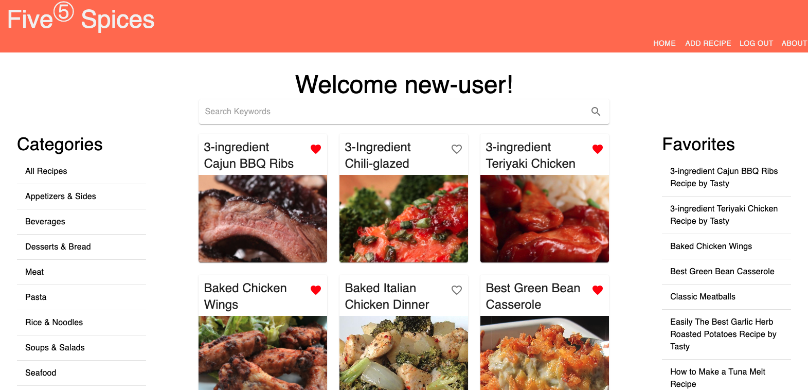
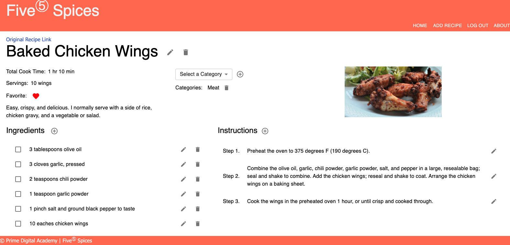

# Five<sup>⑤</sup> Spices

## Description

_Duration: 2 Week Sprint_

Five<sup>⑤</sup> Spices is a recipe tracking application. Five<sup>⑤</sup> Spices allows users to create their own online recipe book. Users can add new recipes, view and search the saved recipes, update any recipes saved in their account to cater it more to their taste, and delete recipes they no longer desire.

To see the fully functional site, please visit: [DEPLOYED VERSION OF APP](https://five-spices-solo-project.herokuapp.com/#/login)

## Screen Shot

Login Page

Home Page

Recipe Details Page


## Prerequisites

- [Node.js](https://nodejs.org/en/)
- [Postgresql](https://www.postgresql.org/download/)
- [Postico](https://eggerapps.at/postico/)

## Installation

- Create a database named `five_spices`,
- The queries in the `database.sql` file are set up to create all the necessary tables and populate some initial data to allow the application to run correctly. The project is built on [Postgres](https://www.postgresql.org/download/), so you will need to make sure to have that installed. We recommend using Postico to run those queries as that was used to create the queries,
- Open up your editor of choice and run an `npm install`
- Run `npm install`
- Create a `.env` file at the root of the project and paste the following lines into the file:
  ```
  SERVER_SESSION_SECRET=superDuperSecret
  REACT_APP_MYCOOKBOOK_API_KEY=apiKey
  ```
  While you're in your new `.env` file, take the time to replace `superDuperSecret` with some long random string like `25POUbVtx6RKVNWszd9ERB9Bb6` to keep your application secure. Here's a site that can help you: [https://passwordsgenerator.net/](https://passwordsgenerator.net/). If you don't do this step, create a secret with less than eight characters, or leave it as `superDuperSecret`, you will get a warning.
  Next, create an account with [RapidAPI](https://rapidapi.com/) and subscribe to MyCookbook.io API. Replace `apiKey` with your RapidAPi key.
- Start postgres if not running already by using `brew services start postgresql`
- Run `npm run server` in your terminal
- Run `npm run client` in your terminal
- The `npm run client` command will open up a new browser tab for you

## Usage

- An user must create a account to use the application
- When an registered user logged in, the user is directed to the Home page. The Home page list 12 recipes with the recipe name, favorite status (an heart icon) and a picture of the recipe. The user can favorite or unfavorite the recipe on the Home page by click on the heart icon. The Home page also shows all of the categories and the user can sort recipes by category clicking on the category name. The home page also lists the name of the user's favorite recipes. The user can also search recipes on the Home page by entering keywords or key phrase to the search field. The user can click on a recipe to see details of the recipe.
- On recipe details page, the user can favorite or unfavorite the recipe, add or delete category information from the recipe, edit any recipe details information, ingredients and instructions. The user can also add ingredient and instructions. The user can also delete the ingredients or even delete the recipe.
- An user can add recipes to the application from the Add Recipe page. The user can add recipes by manually entering them into the application or copy an recipe URL from another site and click the Add Recipe From URL button. After the user click on the Add Recipe From URL button, the recipe information will be automatically loaded into the respective fields. The user can make any changes to the information filled in the input fields, add additional ingredient or instructions, and click on the Save Recipe button to save the recipe.

## Built With

JavaScript, CSS, Node.js, Express, Postman, Postico, Postgresql, Axios, Moment.js, React, React-Router, Redux, Redux-Saga, Material-UI, SweetAlert

## License

[MIT](./LICENSE.txt)

## Acknowledgement

Thanks to [Prime Digital Academy](www.primeacademy.io) who equipped and helped me to make this application a reality.

## Support

If you have suggestions or issues, please email me at [beileiwang@gmail.com](beileiwang@gmail.com)
